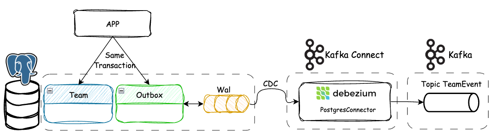
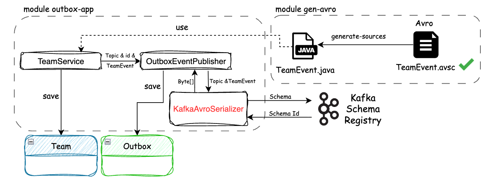

# Outbox Pattern + Debezium + Strict Avro: Stop Schema Drift at the Source

## Introduction

In an event-driven microservices architecture, a service frequently needs to perform two distinct operations: 
**persist** business data in a database and **publish** an event to Kafka. This double write introduces a well-known 
problem: the *Dual-Write Problem*.

As soon as these two operations are no longer **atomic**, the system becomes fragile. If the database commits the 
transaction but Kafka is unavailable, the event is lost. Conversely, if the event is published but the transaction 
fails, inconsistent data is exposed to consumers. In both cases, trust in the system is compromised.

The **Outbox pattern** provides an elegant solution to this problem. Instead of publishing directly to Kafka, the 
event is written into a dedicated table within the same transaction as the business data. This approach guarantees 
that the business state and the associated event evolve in strict consistency.

To extract these events from the database without impacting application performance, we rely on the database engine's 
internal mechanism: the **WAL (Write-Ahead Log)**. This transaction log sequentially records every modification even 
before it is applied to the persistent data.

The technique of listening to this log to capture modifications is called **CDC (Change Data Capture)**. Unlike 
time-consuming periodic polling, CDC allows for real-time reactions to new records in the WAL.

To implement this approach, **Debezium** has established itself as the standard solution. Connected directly to 
PostgreSQL, it continuously reads the WAL via logical replication and asynchronously and reliably propagates events 
from the Outbox table to Kafka.



At this stage, the atomicity problem is solved. But another, often underestimated risk emerges: schema drift.

---

## The Limits of the Classic Outbox

In most implementations, the payload of the Outbox table is stored as **JSON**. This approach has the advantage of 
being simple, but it introduces a structural weakness: the lack of a strict contract.

Nothing actually prevents a developer from modifying the payload structure without coordination. The system tolerates 
these deviations until a consumer breaks in production. The problem is then detected too late, and more importantly, 
in the wrong place.

This model relies implicitly on human discipline. However, in a distributed system, robustness should never depend on 
implicit conventions. It must be enforced by the system itself.

---

## Enforcing a Contract with the “Strict Avro” Approach

The idea is simple: shift schema validation as early as possible, i.e., to the **producer** side, even before writing 
to the database.

In practice, the payload is no longer stored as **JSON**, but in **binary** form, after serialization via 
`KafkaAvroSerializer`. This means that every event inserted into the Outbox table already conforms to a schema 
validated by the **Schema Registry**. If it does not, the serialization fails immediately, and the transaction 
is **rolled back**.

This change has a massive impact. We are no longer just transporting data; we guarantee its structural validity right 
from its creation. The database can no longer contain invalid events, and Kafka no longer becomes an error discovery 
point.



**Debezium**, in this model, voluntarily relinquishes any transformation responsibility. It merely **transports** 
an already validated binary payload. This simplification is an advantage: less intermediary logic, fewer points of
failure.

## Comparison Table: JSON Outbox vs Strict Avro Outbox

| Criterion | JSON Outbox | Strict Avro Outbox |
|---|---|---|
| Stored payload format | Readable JSON in DB | Avro Binary (`BYTEA`) |
| Schema Contract | Weak, often implicit | Strong, enforced by the Avro schema |
| Error detection timing | Often on the consumer side or in production | At serialization on the producer side |
| Schema drift risk | High if discipline is not strict | Significantly reduced by upstream validation |
| Role of Debezium / Kafka Connect | May require more interpretation or transformation | Transports an already validated payload |
| Database readability | Excellent for manual debugging | Low without decoding tools |
| Coupling to Kafka ecosystem | Weaker | Stronger (Schema Registry, Avro, serializer) |
| Evolution governance | Relies more on teams and conventions | Governed by Schema Registry compatibility rules |
| Implementation complexity | Simpler to start | More demanding, but more robust at scale |

In practice, **JSON Outbox** maximizes simplicity and readability, while **Strict Avro Outbox** prioritizes 
**contractual reliability**, **early error detection**, and **schema governance**.

## A Clear Chain of Responsibility

With this approach, each component has a strictly defined role.

The application is responsible for the **compliance** of the events. It serializes the payloads and guarantees their 
compatibility with the schema. The database ensures **atomicity** between the business data and the event. **Debezium**, 
for its part, merely reads the WAL and publishes to Kafka without interpreting the content.

This clear separation of responsibilities makes the system much more predictable. It becomes **impossible** to introduce
an invalid event without it failing immediately, as close to the source as possible.

---

# Implementation

## PostgreSQL Configuration

To allow Debezium to function correctly, PostgreSQL must be configured for logical replication. This requires enabling 
the `wal_level` parameter in `logical` mode. Without this, no CDC mechanism is possible. Parameters related to 
replication slots and WAL senders must also be properly dimensioned.

### Required parameters

```
wal_level=logical
max_replication_slots=5
max_wal_senders=5
-- Check value
SHOW wal_level;
SHOW max_replication_slots;
SHOW max_wal_senders;
```

### Creating the Outbox and HeartBeat tables

The Outbox table is the core of the pattern. It must be created and used by the same user as the business application,
not by Debezium. This point is important: writing to the Outbox is part of the business transaction, so it must remain
under the control of the application.

The `debezium_heartbeat` table is required to keep the connector active and manage the progression of the WAL (we will
return to this mechanism below).

```sql
CREATE TABLE IF NOT EXISTS outbox_events (
    id                  UUID PRIMARY KEY,
    topic               VARCHAR(255) NOT NULL,
    aggregate_id        VARCHAR(255) NOT NULL,
    event_type          VARCHAR(50) NOT NULL,
    payload             BYTEA NOT NULL,
    created_at          TIMESTAMP WITH TIME ZONE DEFAULT CURRENT_TIMESTAMP
                                      );

CREATE TABLE IF NOT EXISTS debezium_heartbeat (
  id INT PRIMARY KEY,
  last_heartbeat TIMESTAMP WITH TIME ZONE DEFAULT CURRENT_TIMESTAMP
);

INSERT INTO debezium_heartbeat (id, last_heartbeat) VALUES (1, CURRENT_TIMESTAMP) ON CONFLICT (id) DO NOTHING;
```

### Permissions Configuration

Using a dedicated user (`debezium_user`) for CDC is highly recommended. This allows for the compartmentalization of 
responsibilities and the application of the least privilege principle. This user is not intended to write to the 
database. It only reads changes via the logical replication mechanism. The `REPLICATION` role is essential, as it 
allows Debezium to create and use a **replication slot**, which is the mechanism ensuring no WAL event will be lost.

```sql
CREATE ROLE debezium_user WITH REPLICATION LOGIN PASSWORD 'password';

GRANT CONNECT ON DATABASE defaultdb TO debezium_user;
GRANT USAGE ON SCHEMA public TO debezium_user;

GRANT SELECT ON TABLE public.outbox_events TO debezium_user;
GRANT SELECT, UPDATE ON TABLE public.debezium_heartbeat TO debezium_user;
```

### Logical Publication

The explicit creation of the publication is a deliberate choice. Debezium can create it automatically, but maintaining 
control on the database side allows for precise management of which tables are exposed. In this case, only the 
`outbox_events` and `debezium_heartbeat` tables are included. This avoids needlessly exposing other tables and reduces 
processing load.

```sql
CREATE PUBLICATION dbz_publication FOR TABLE 
       public.outbox_events, 
       public.debezium_heartbeat 
       WITH (publish='insert,update');
```

### Verifications

```sql
SELECT * FROM pg_publication;
SELECT * FROM pg_publication_tables;
SELECT * FROM pg_replication_slots;
```

### Replication Slot Monitoring

The replication slot is a critical element of the setup. It ensures that PostgreSQL retains WAL segments until Debezium 
has consumed them. This allows for reliable, lossless reading. However, this mechanism has a significant side effect: 
if the connector is stopped or lagging, the WALs are no longer purged. Disk space can then grow rapidly.

To monitor this state, the following query is essential:

```sql
SELECT slot_name,
       active,
       restart_lsn,
       pg_size_pretty(pg_wal_lsn_diff(pg_current_wal_lsn(), restart_lsn)) AS retained_wal
FROM pg_replication_slots;
```

This query shows:

- If the slot is active
- How many WALs are retained

In production, this metric must be monitored. An inactive slot is an immediate alert signal.

## Connector Configuration

The Debezium PostgreSQL connector is deployed on Kafka Connect. Here is a production-ready configuration:

```json
{
  "name": "postgres-to-kafka-connector",
  "config": {
    "connector.class": "io.debezium.connector.postgresql.PostgresConnector",
    "database.hostname": "your_hostname",
    "database.port": "5432",
    "database.user": "debezium_user",
    "database.password": "${file:/opt/vault_secrets/connector-dbz.properties:db_password}",
    "database.dbname": "defaultdb",
    "tasks.max": "1",
    "table.include.list": "public.outbox_events",
    "topic.prefix": "demo",
    "plugin.name": "pgoutput",
    "slot.name": "debezium_slot",
    "snapshot.mode": "initial",
    "publication.name": "dbz_publication",
    "publication.autocreate.mode": "filtered",
    "key.converter": "org.apache.kafka.connect.storage.StringConverter",
    "key.converter.schemas.enable": "false",
    "value.converter": "io.debezium.converters.BinaryDataConverter",
    "value.converter.delegate.converter.type": "io.confluent.connect.avro.AvroConverter",
    "value.converter.delegate.converter.type.basic.auth.credentials.source": "USER_INFO",
    "value.converter.delegate.converter.type.basic.auth.user.info": "${file:/opt/vault_secrets/connector-dbz.properties:sr_user}:${file:/opt/vault_secrets/connector-dbz.properties:sr_pwd}",
    "value.converter.delegate.converter.type.schema.registry.url": "your_url_schema_registry",
    "transforms": "outbox",
    "transforms.outbox.type": "io.debezium.transforms.outbox.EventRouter",
    "transforms.outbox.route.by.field": "topic",
    "transforms.outbox.route.topic.replacement": "${routedByValue}",
    "transforms.outbox.table.field.event.id": "id",
    "transforms.outbox.table.field.event.key": "aggregate_id",
    "transforms.outbox.table.field.event.payload": "payload",
    "transforms.outbox.table.field.event.type": "event_type",
    "transforms.outbox.table.fields.additional.placement": "event_type:header:eventType,created_at:header:messageTimestamp",
    "topic.creation.default.replication.factor": 1,
    "topic.creation.default.partitions": 1,
    "topic.heartbeat.prefix": "demo-heartbeat",
    "heartbeat.interval.ms": 10000,
    "heartbeat.action.query": "UPDATE public.debezium_heartbeat SET last_heartbeat = NOW() WHERE id = 1",
    "errors.tolerance": "none",
    "errors.log.enable": "true",
    "errors.log.include.messages": "true",
    "tombstones.on.delete": "false"
  }
}
```

The use of `"value.converter": "io.debezium.converters.BinaryDataConverter"` is crucial here: this specific converter 
tells Kafka Connect to take the `BYTEA` field from the database and inject it *as is* into the Kafka message, without 
trying to deserialize or interpret it, thus preserving the Avro binary natively generated by the application.

Additionally, the `transforms.outbox.*` properties configure Debezium's `EventRouter` SMT (Single Message Transform) 
to extract the binary payload from the Outbox and route it dynamically to the correct Kafka topic.

### Heartbeat and WAL Management

The heartbeat mechanism forces regular writes to the WAL, via a query executed every 10 seconds:

```sql
UPDATE public.debezium_heartbeat
SET last_heartbeat = NOW()
WHERE id = 1;
```

The heartbeat serves to:

- **Prove that the connector is advancing**: even in the absence of business events, we can distinguish a healthy 
connector from a blocked one.
- **Prevent WAL accumulation**: by generating regular traffic, the replication slot advances, which enables the cleanup
of old segments.

⚠️ Without a heartbeat, an inactive system can unnecessarily accumulate WALs and saturate disk space.

## Connector Deployment

The Debezium connector is deployed via the Kafka Connect REST API. The state returned by the `/status` endpoint allows 
you to quickly check if the connector is in error, running, or restarting. Since the replication slot is persistent on 
the PostgreSQL side, redeploying the connector does not cause data loss, provided the configuration (`slot.name`) 
remains identical.

```bash
# Deploy connector using Kafka Connect REST API
curl -X POST http://localhost:8083/connectors \
  -H "Content-Type: application/json" \
  -d @postgres-to-kafka-connector.json

# Check connector status
curl http://localhost:8083/connectors/postgres-to-kafka-connector/status

# Delete connector
curl -X DELETE http://localhost:8083/connectors/postgres-to-kafka-connector
```

## Purging the Outbox Table

In a production system, the `outbox_events` table is not meant to keep messages indefinitely. Once Debezium has 
consumed and published the events, they can be deleted to prevent infinite table growth and performance degradation.

A common strategy is to implement an asynchronous batch (e.g., using `@Scheduled` in Spring) that deletes records older
than a few days. This purge runs outside the critical path and keeps the database lean.

# Application

The `OutboxEventPublisher` service materializes the single entry point for publishing events. Its role is simple: 
serialize the Avro payload and persist the event in the Outbox table.

The use of `@Transactional(propagation = Propagation.MANDATORY)` is a key point. It forces this method to always be 
called within an existing transaction. This prevents any out-of-business-context publishing and guarantees atomicity.

Serialization via `KafkaAvroSerializer` is performed before insertion into the database. If the schema is invalid or 
incompatible, an exception is immediately thrown, causing a full rollback of the transaction.

🫡 This behavior is deliberately strict: an invalid event must never reach the database.

```java
@Service
public class OutboxEventPublisher {

    private final OutboxJpaRepository outboxJpaRepository;
    private final KafkaAvroSerializer kafkaAvroSerializer;

    public OutboxEventPublisher(OutboxJpaRepository outboJpaRepository,
                                KafkaAvroSerializer kafkaAvroSerializer) {
        this.outboxJpaRepository = outboJpaRepository;
        this.kafkaAvroSerializer = kafkaAvroSerializer;
    }

    @Transactional(propagation = Propagation.MANDATORY)
    public <K, V extends SpecificRecord> void publish(String topic, K aggregateId, V payload, OutboxEventType eventType) {

        OutboxJPA outboxJPA = new OutboxJPA();

        outboxJPA.setTopic(topic);
        outboxJPA.setAggregateId(aggregateId.toString());
        outboxJPA.setEventType(eventType);
        outboxJPA.setPayload(kafkaAvroSerializer.serialize(topic, payload));
        outboxJPA.setCreatedAt(Instant.now());

        outboxJpaRepository.save(outboxJPA);
    }
}
```

The `OutboxProducer` class introduces an interesting abstraction. It allows manipulating the Outbox like a classic 
Kafka producer, while remaining natively in the transactional scope of the database.

The generic typing `<K, V extends SpecificRecord>` enforces the use of generated Avro objects. This guarantees, from 
compilation, that only payloads conforming to the Schema Registry can be used.

This approach brings the developer experience closer to a `KafkaTemplate`, while retaining the guarantees of the Outbox 
pattern. The developer publishes an event without worrying about the underlying mechanism.

```java
public class OutboxProducer<K, V extends SpecificRecord> {

    private final OutboxEventPublisher outboxEventPublisher;
    private final String topic;

    public OutboxProducer(OutboxEventPublisher outboxEventPublisher, String topic) {
        this.outboxEventPublisher = outboxEventPublisher;
        this.topic = topic;
    }

    /**
     * Publishes an event to the outbox table.
     * Must be called within an active transaction.
     *
     * @param aggregateId The aggregate ID (key) for the event
     * @param payload     The Avro object payload
     * @param eventType   The type of the event (e.g., CREATE, UPDATE, DELETE)
     */
    @Transactional(propagation = Propagation.MANDATORY)
    public void publish(K aggregateId, V payload, OutboxEventType eventType) {
        outboxEventPublisher.publish(topic, aggregateId, payload, eventType);
    }
}
```

The explicit use of an `aggregateId` (often a UUID) here is fundamental because it is mapped by Debezium as the Kafka 
message key. This partitioning by aggregate guarantees strict ordering of processing and operational consistency for 
the same entity on the consumer side.

The `OutboxEventType` enumeration structures the nature of the produced events. It makes it possible to clearly 
distinguish business operations (CREATE, UPDATE, DELETE) and to enrich the message with semantic information usable 
by consumers.

```java
public enum OutboxEventType {
    CREATE,
    UPDATE,
    DELETE
}
```

The `TeamService` example perfectly illustrates the integration of the pattern in a real case.

Creating the entity and publishing the event are done in the **same transaction**. If an error occurs at any 
time—whether during **persistence** or Avro **serialization**—everything is **rolled back**.

The crucial point here is the order of operations. The entity is persisted first, mapping its stable identifier. 
This identifier is then embedded in the Avro event, ensuring consistency between the DB row and the message content.

The developer remains in a simple model: manipulating JPA entities and publishing an event. All the complexity tied 
to Kafka, schemas, and transport is encapsulated.

```java
@Service
public class TeamService {

    private final TeamRepository teamRepository;
    private final OutboxProducer<UUID, TeamEvent> teamEventProducer;

    public TeamService(TeamRepository teamRepository, OutboxEventPublisher outboxEventPublisher) {
        this.teamRepository = teamRepository;
        this.teamEventProducer = new OutboxProducer<>(outboxEventPublisher, "TeamEvent");
    }

    @Transactional
    public TeamEntity createTeamWithMembers(String teamName, String description, List<String> memberNames) {
        
        // 1. Business logic: create the aggregate
        final TeamEntity team = new TeamEntity();
        team.setName(teamName);
        team.setDescription(description);
        // ... (nested loop to add members omitted for clarity) ...

        // 2. Persist the entity within the transaction
        TeamEntity teamSaved = teamRepository.save(team);

        // 3. Build the Avro event from the generated strict contract
        TeamEvent teamEvent = TeamEvent.newBuilder()
                .setId(teamSaved.getId().toString())
                .setName(teamSaved.getName())
                .setDescription(teamSaved.getDescription())
                // ... (MemberEvent mapping omitted for clarity) ...
                .build();

        // 4. Publish the event through the Outbox within the same transaction
        teamEventProducer.publish(teamSaved.getId(), teamEvent, OutboxEventType.CREATE);
        
        return team;
    }
}
```

# Conclusion

Combining the Outbox pattern with a "Strict Avro" approach allows you to build a 
**reliable, deterministic, and governed** event pipeline. You no longer just solve the atomicity problem; you also 
guarantee the **quality of the events** from their inception.

The main advantage of this approach lies in its **fail-fast** nature. Any contract violation is detected immediately, 
at the time of serialization. This prevents errors from propagating through the system and significantly cuts down 
incidents linked to *Schema Drift*. The schema becomes an executable component, continuously validated, rather than a 
mere convention.

This rigor comes with a **clear chain of responsibility**. The application ensures data compliance, the database 
guarantees atomicity, and Debezium handles reliable transport. This separation reduces overall complexity and improves 
system readability.

Operationally, this approach also brings concrete benefits. Since the payload is pre-serialized, there is no 
transformation cost on the Kafka Connect side. The pipeline is more direct, performs better, and is easier to reason 
about. Schema governance through the Schema Registry allows for precise control of contract evolution over time.

However, these gains come with compromises that must be accepted.

The first is **tight coupling with the Kafka and Avro ecosystem**. The outbox table no longer contains neutral 
business data, but a message already formatted for Kafka. This choice reduces flexibility and makes reuse in other 
contexts more difficult.

This coupling also seeps into the application code, which becomes dependent on the `KafkaAvroSerializer` and the 
Schema Registry. This introduces additional complexity during development, especially for testing and local environments.

Another drawback is the **loss of data readability in the database**. Binary storage makes investigations more 
complex and requires specific tools to decode messages. Where JSON allowed for quick diagnostics, this approach 
requires discipline and tooling.

Dependency on the Schema Registry is also a sensitive point. In case of unavailability, event generation is blocked, 
which can directly affect business transactions. However, it's worth noting that the **`KafkaAvroSerializer` 
has a local cache**. If the application has already registered or retrieved the schema upstream, it can continue to 
serialize and publish messages even if the Schema Registry is temporarily unreachable.

Finally, schema evolution becomes more tightly controlled due to the **compatibility rules** enforced by the Schema 
Registry (Backward, Forward, Full). If a developer modifies a schema in a non-compatible way (e.g., removing a 
mandatory field), validation will fail before deployment. While this improves overall stability by preventing the 
deployment of anomalies, it also requires **strong discipline** and can slow down evolutions, particularly in contexts 
where data models change rapidly.

---

Ultimately, this approach will be particularly relevant in large-scale environments where:

- Event reliability is absolutely critical.
- Consumers are numerous and independent.
- Production schema errors would have a huge organizational impact.

The bet is a deliberate trade-off:

**Accepting an overhead of complexity and ecosystem coupling, to gain a system with relentless reliability, 
predictability, and zero schema drift.**

## References

- Github Repo: https://github.com/Thieus/demo-pattern-outbox-with-dbz
- Debezium: https://debezium.io/documentation/reference/3.4/connectors/postgresql.html
- Debezium: https://debezium.io/documentation/reference/3.4/transformations/outbox-event-router.html

